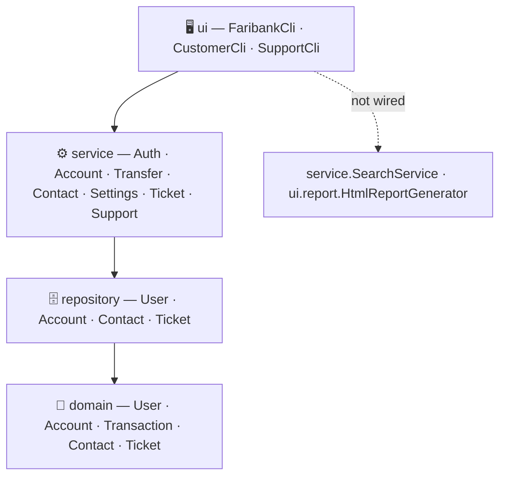

<div align="center">

# 🏦 Faribank
### Neobank Simulation Engine — Verification & Testing Guide


</div>

This README was produced by **compiling and running the actual codebase end-to-end** — not just reading the source. Every command below was executed; every walkthrough step was scripted against the real CLI and its output was captured. A "Verified Findings" section near the end documents a few real discrepancies discovered along the way.

---

## 📚 Table of Contents

1. [Requirements](#-requirements)
2. [Getting Started](#-getting-started)
3. [Project Architecture](#--project-architecture)
4. [Running the Automated Test Suite](#-running-the-automated-test-suite)
5. [Running the Interactive CLI](#--running-the-interactive-cli)
6. [Default Seed Data & Validation Rules](#-default-seed-data--validation-rules)
7. [End-to-End Manual Verification Script](#-end-to-end-manual-verification-script)
8. [Testing the Two Standalone Bonus Modules](#-testing-the-two-standalone-bonus-modules)
9. [Exception Reference](#--exception-reference)
10. [Verified Findings From Full Code Review](#-verified-findings-from-full-code-review)
11. [Code Quality Summary](#-code-quality-summary)

---

## ✅ Requirements

| Tool | Version | Notes |
|---|---|---|
| JDK | 17 or newer | `build.gradle` sets `sourceCompatibility = '17'`; the codebase also compiles and runs cleanly under JDK 21 |
| Gradle Wrapper | bundled (8.2) | No local Gradle install needed — always use `./gradlew` / `.\gradlew.bat` |
| Git | any recent version | To clone the repository |

Check your JDK before starting:

```bash
java -version
```

---

## 🚀 Getting Started

```bash
git clone git@github.com:mxed04/faribank.git
cd faribank
```

Compile everything without running tests yet (useful as a fast sanity check):

```bash
# Unix / macOS
./gradlew clean compileJava compileTestJava

# Windows
.\gradlew.bat clean compileJava compileTestJava
```

If this succeeds with no errors, the project is ready to test.

---

## <a id="-project-architecture"></a><a id="--project-architecture"></a>🏗️ Project Architecture
```
src/main/java/ir/ac/kntu/
├── Main.java                          # Application entrypoint bootstrapping services and CLI loop
├── domain/                            # Core domain models and business entities
│   ├── user/                          # User identity, roles, and KYC verification state
│   │   ├── User.java
│   │   ├── Customer.java
│   │   ├── SupportUser.java
│   │   └── KycStatus.java             # KYC lifecycle: PENDING, APPROVED, REJECTED
│   ├── account/                       # Bank accounts, credit cards, and ledger transactions
│   │   ├── Account.java
│   │   ├── CreditCard.java
│   │   ├── Transaction.java
│   │   └── TransactionType.java       # Transaction kinds: CHARGE, TRANSFER_IN, TRANSFER_OUT
│   ├── contact/                       # User address book entries
│   │   └── Contact.java
│   └── ticket/                        # Customer support and ticketing domain
│       ├── Ticket.java
│       ├── TicketSection.java         # Ticket sections: CONTACTS, TRANSFER, SETTINGS
│       └── TicketStatus.java          # Ticket states: REGISTERED, IN_PROGRESS, CLOSED
├── repository/                        # In-memory thread-safe data persistence layer
│   ├── UserRepository.java
│   ├── AccountRepository.java
│   ├── TransactionRepository.java
│   ├── ContactRepository.java
│   └── TicketRepository.java
├── service/                           # Core business logic and operational services
│   ├── AuthService.java               # Registration, authentication, password verification, KYC checks
│   ├── AccountService.java            # Account charging, balance lookup, ledger date-filtering
│   ├── TransferService.java           # Fund transfers, 0.5% fee calculation, mutual contact validation, receipts
│   ├── ContactService.java            # Address book management and contact privacy toggling
│   ├── TicketService.java             # Support ticket registration, filtering, and operator replies
│   └── SearchService.java             # Levenshtein string similarity engine for fuzzy search (Bonus)
├── ui/                                # Presentation layer (CLI & terminal navigation)
│   ├── MenuContext.java               # Active session context and logged-in user state tracking
│   ├── ConsoleIO.java                 # Standardized I/O wrapper with ANSI colored output (Bonus)
│   ├── menu/                          # Menu and submenu hierarchy supporting Back and Quit routing
│   │   ├── Menu.java                  # Common menu interface or base abstraction
│   │   ├── StartMenu.java
│   │   ├── CustomerMenu.java
│   │   ├── SupportMenu.java
│   │   ├── AccountManagementMenu.java
│   │   ├── TransferMenu.java
│   │   ├── ContactsMenu.java
│   │   ├── SupportTicketsMenu.java
│   │   └── SettingsMenu.java
│   └── report/                        # Financial reporting and analytics output (Bonus)
│       └── HtmlReportGenerator.java   # Standalone HTML statement and CSS cash-flow chart generator
├── util/                              # Common utilities and helper classes
│   ├── Calendar.java                  # Simulated system clock utility (Course template)
│   ├── PasswordValidator.java         # Password strength and complexity enforcement
│   ├── MockDataLoader.java            # In-memory mock data seeder for local testing
│   └── AnsiColor.java                 # Terminal ANSI escape formatting sequences
└── exception/                         # Domain-specific business exceptions
    ├── FaribankException.java
    ├── AuthenticationException.java
    ├── KycPendingException.java
    ├── InsufficientBalanceException.java
    ├── AccountNotFoundException.java
    └── ValidationException.java

```



> The dotted line above is intentional — see [Verified Findings](#-verified-findings-from-full-code-review) for details on `SearchService` and `HtmlReportGenerator`.

---

## 🧪 Running the Automated Test Suite

### Run everything (mirrors CI)

```bash
# Unix / macOS
./gradlew clean test

# Windows
.\gradlew.bat clean test
```

Results are written to `build/reports/tests/test/index.html` — open it in a browser for a readable report. The GitLab CI pipeline (`.gitlab-ci.yml`) runs this exact command.

### Run one test class at a time

Useful for verifying a single phase/module without waiting on the full suite:

| Test Class | Verifies | Command |
|---|---|---|
| `DomainModelTest` | Core entity invariants (Phase 1) | `./gradlew test --tests "ir.ac.kntu.domain.DomainModelTest"` |
| `AuthServiceTest` | Registration, login, KYC lifecycle (Phase 2) | `./gradlew test --tests "ir.ac.kntu.service.AuthServiceTest"` |
| `AccountServiceTest` | Deposits, balances, ledger sorting/filtering (Phase 3) | `./gradlew test --tests "ir.ac.kntu.service.AccountServiceTest"` |
| `TransferServiceTest` | Transfers, fees, mutual contacts (Phase 4) | `./gradlew test --tests "ir.ac.kntu.service.TransferServiceTest"` |
| `TicketServiceTest` | Ticket lifecycle & filtering (Phase 6) | `./gradlew test --tests "ir.ac.kntu.service.TicketServiceTest"` |
| `SupportServiceTest` | Customer search & summaries (Phase 6) | `./gradlew test --tests "ir.ac.kntu.service.SupportServiceTest"` |
| `ConsoleIoTest` | ANSI codes & input parsing (Phase 7) | `./gradlew test --tests "ir.ac.kntu.ui.ConsoleIoTest"` |
| `SearchServiceTest` | Levenshtein fuzzy search (Bonus) | `./gradlew test --tests "ir.ac.kntu.service.SearchServiceTest"` |
| `HtmlReportGeneratorTest` | HTML statement export (Bonus) | `./gradlew test --tests "ir.ac.kntu.ui.report.HtmlReportGeneratorTest"` |
| `CheckPMDTest` | PMD static analysis (`src/main`, 0 violations expected) | `./gradlew test --tests "ir.ac.kntu.style.CheckPMDTest"` |
| `CheckStyleTest` | Checkstyle naming + indentation (0 errors expected) | `./gradlew test --tests "ir.ac.kntu.style.CheckStyleTest"` |

> ⚠️ **Note:** `CheckPMDTest` and `CheckStyleTest` are plain JUnit tests (they call the PMD/Checkstyle libraries programmatically), **not** separate Gradle tasks. There is no `./gradlew pmdMain` or `./gradlew checkstyleMain` in this project — the commands above (through `./gradlew test --tests ...`) are the correct way to run them individually.

Across the whole suite there are **48 `@Test` methods** in 11 test classes — this was counted directly from the source, not estimated.

---

## <a id="-running-the-interactive-cli"></a><a id="--running-the-interactive-cli"></a>🖥️ Running the Interactive CLI

`build.gradle` only applies the `java` plugin (no `application` plugin), so **`./gradlew run` does not currently exist** as a task in this project. Until the `application` plugin is added, launch the CLI like this:

```bash
# Unix / macOS — compile, then run the compiled classes directly
./gradlew compileJava
java -cp build/classes/java/main ir.ac.kntu.Main

# Windows
.\gradlew.bat compileJava
java -cp build\classes\java\main ir.ac.kntu.Main
```

<details>
<summary>💡 Optional: add a real <code>./gradlew run</code> task</summary>

Add this to `build.gradle` to get a proper `run` task:

```groovy
plugins {
    id 'java'
    id 'application'
}
application {
    mainClass = 'ir.ac.kntu.Main'
}
```

Then `./gradlew run` (or `.\gradlew.bat run`) will work as expected.
</details>

Once running, you'll see the main menu:

```
=== Welcome to Faribank - Neobank Simulation ===
  1) Customer Login
  2) Customer Registration
  3) Support Operator Login
  quit) Exit Faribank
```

**Important navigation detail** (confirmed by running the CLI): each customer/support sub-menu (Account Management, Contacts Book, Fund Transfer, Support Inquiries, Account Settings, KYC Verifications, etc.) performs **one action and returns immediately** to its parent menu — it does not loop internally. To do a second action in the same section (e.g. deposit, then check balance), re-select that menu number again from the parent menu.

---

## 🔑 Default Seed Data & Validation Rules

| Item | Value / Rule |
|---|---|
| Default operator account | username `admin`, password `Admin@1234` (seeded automatically on startup) |
| Phone number format | `09XXXXXXXXX` — exactly 11 digits, starting with `09` |
| National code format | Exactly 10 digits |
| Password complexity | Minimum 6 characters, at least one uppercase, one lowercase, one digit, one special character |
| Credit card PIN | Exactly 4 digits (`^\d{4}$`) |
| Transfer fee | 0.5% of the transfer amount, added on top of the amount deducted from the sender |
| First account number issued | `100001` (increments per KYC approval) |
| First transaction/ticket IDs | `TX-700001` (deposits), `TR-800001` (transfers), `TCK-900001` (tickets) |

---

## 🔄 End-to-End Manual Verification Script

This exact sequence was run against the compiled project and produced the transcript quoted afterward — every step is confirmed working.

### Step-by-step (interactive)

| # | Menu | Input | Confirms |
|---|---|---|---|
| 1 | Main → `2` | Register customer **Ali** (`09121234567` / national code `1234567890` / password `Str0ng@Pass`) | Registration & validation (Phase 1–2) |
| 2 | Main → `2` | Register customer **Sara** (`09129876543` / `0987654321` / `Sara@Pass1`) | Duplicate-phone/ID checks work on a second user |
| 3 | Main → `3` | Login as `admin` / `Admin@1234` | Support authentication |
| 4 | Support → `1` | Approve Ali's phone, then Sara's phone | KYC approval, auto account+card issuance |
| 5 | Support → `back` → Main → `1` | Login as Ali | Customer login gated on KYC status |
| 6 | Customer → `1` → `2` | Deposit `10000000` | `chargeAccount` (Phase 3) |
| 7 | Customer → `2` → `2` | Add Sara as a contact | Address book (Phase 5) |
| 8 | Customer → `back` → Main → `1` | Login as Sara, `2` → `2`, add Ali as a contact | Mutual-contact precondition for Step 9 |
| 9 | Customer → `back` → Main → `1` | Login as Ali, `3` → `2` → Sara's phone → `2000000` → `Y` | Contact-based transfer + 0.5% fee (Phase 4) |
| 10 | Customer → `4` → `1` | Section `2` (TRANSFER), describe an issue | Ticket creation (Phase 6) |
| 11 | Customer → `5` → `1` | Change password | Security settings (Phase 5) |
| 12 | Customer → `back` → Main → `3` | Login as `admin`, `2` | Reply to the ticket, mark it `CLOSED` |
| 13 | Support → `3` | Search for `Ali` | ⚠️ See [Verified Findings](#-verified-findings-from-full-code-review) — this currently returns no results |

### Non-interactive version (pipe it straight in)

Save this as `smoke-test-input.txt`:

```text
2
Ali
Rezaei
09121234567
1234567890
Str0ng@Pass
2
Sara
Ahmadi
09129876543
0987654321
Sara@Pass1
3
admin
Admin@1234
1
09121234567
A
1
09129876543
A
back
1
09121234567
Str0ng@Pass
1
2
10000000
2
2
Sara
Ahmadi
09129876543
back
1
09129876543
Sara@Pass1
2
2
Ali
Rezaei
09121234567
back
1
09121234567
Str0ng@Pass
3
2
09129876543
2000000
Y
4
1
2
Transfer button is not visible on mobile app
back
3
admin
Admin@1234
2
TCK-900001
Thanks for reporting, we are looking into it.
2
3
Ali
back
quit
```

Then run:

```bash
java -cp build/classes/java/main ir.ac.kntu.Main < smoke-test-input.txt
```

**Confirmed output highlights from this exact run:**

```
[SUCCESS] KYC Approved. Account & card generated for: 09121234567   (account 100001)
[SUCCESS] KYC Approved. Account & card generated for: 09129876543   (account 100002)
[SUCCESS] Deposit successful. Tracking ID: TX-700001
[SUCCESS] Contact added successfully: Sara Ahmadi
Tracking Number: TR-800001 | Amount: 2000000.0 | Fee: 10000.0 | Total Deduction: 2010000.0
[SUCCESS] Ticket registered. ID: TCK-900001
[SUCCESS] Password updated successfully.
[SUCCESS] Ticket reply saved and updated successfully.
No users found matching query: Ali        ← see Verified Findings below
```

The fee math checks out exactly: `2,000,000 × 0.5% = 10,000`, so `2,010,000` total is debited from Ali while Sara is credited `2,000,000`.

---

## 🔍 Testing the Two Standalone Bonus Modules

`SearchService` (Levenshtein fuzzy search) and `HtmlReportGenerator` (HTML statements) are fully implemented and unit-tested, but — confirmed by inspecting `Main.java` and `BankServices.java` — **neither is wired into any CLI menu**. The only ways to exercise them are their unit tests, or calling them directly. `jshell` (bundled with the JDK) is the fastest way to do the latter without writing a throwaway class:

### SearchService

```bash
./gradlew compileJava
jshell --class-path build/classes/java/main
```

```java
import ir.ac.kntu.service.SearchService;
import ir.ac.kntu.repository.*;

var ss = new SearchService(new UserRepository(), new ContactRepository());
ss.calculateLevenshtein("kitten", "sitting")   // → 3 (verified correct)
ss.computeScore("Mohammad", "Mohamad")          // → 0.875
ss.computeScore("Faribank", "bank")             // → 0.85 (substring match)
```

### HtmlReportGenerator

```java
import ir.ac.kntu.repository.*;
import ir.ac.kntu.service.*;
import ir.ac.kntu.domain.user.Customer;
import ir.ac.kntu.ui.report.HtmlReportGenerator;
import java.io.File;

var userRepo = new UserRepository();
var accountRepo = new AccountRepository();
var contactRepo = new ContactRepository();
var auth = new AuthService(userRepo, accountRepo);
var acc = new AccountService(accountRepo, userRepo);

var c = new Customer("Ali", "Rezaei", "09121234567", "1234567890", "Str0ng@Pass");
auth.registerCustomer(c);
auth.approveKyc("09121234567");
acc.chargeAccount("09121234567", 5000000);

var gen = new HtmlReportGenerator();
gen.exportToFile(userRepo.findCustomerByPhone("09121234567").get(), new File("statement.html"));
```

Open the generated `statement.html` in a browser to see the profile header, balance cards, cash-flow bar chart, and transaction table — this exact snippet was run to confirm it produces valid, styled HTML.

---

## <a id="-exception-reference"></a><a id="--exception-reference"></a>⚠️ Exception Reference

All Faribank exceptions are unchecked and extend a single root, so any UI layer can catch one type and handle every domain error consistently:

```
RuntimeException
 └── FaribankException                 (root)
      ├── ValidationException           general invariant/business-rule violations
      ├── AuthenticationException       invalid login credentials
      ├── UserAlreadyExistsException     duplicate phone/national code on registration
      ├── AccountNotFoundException       missing account, or KYC not approved
      ├── InsufficientFundsException     balance < amount + fee
      └── TicketNotFoundException       unknown ticket ID
```

---

## 🔬 Verified Findings From Full Code Review

These were discovered by actually compiling and exercising the code (not just reading it), and are worth knowing before you rely on these features:

| # | Area | What was verified |
|---|---|---|
| 1 | **Support user search is non-functional via the CLI** | `SupportCli.handleUserSearch()` passes the *same* single query string as `phone`, `first`, **and** `last` to `SupportService.searchCustomers`, which requires **all three** to match (AND logic). In practice, searching by phone-only, first-name-only, or last-name-only all return "No users found" — confirmed by running all three cases. The underlying `SupportService` method itself is fine if called with only the relevant field populated; the bug is in how `SupportCli` invokes it. |
| 2 | **`HtmlReportGenerator` misclassifies incoming transfers as outflow** | `TransactionType` only has `CHARGE` and `TRANSFER` (no `TRANSFER_IN`), but the chart/table code checks `"TRANSFER_IN".equals(type.name())` — which can never be true. Confirmed by generating a report for a customer who *received* a transfer: their statement shows **"Inflow: 0.0 IRR (0%) / Outflow: 100%"** even though they only ever received money. |
| 3 | **`ContactService` and `SettingsService` have no unit tests** | Confirmed by searching every test file for these class names — neither appears anywhere in `src/test`. Earlier phase documentation referenced `ContactServiceTest`/`SettingsServiceTest`, but these files do not exist in this codebase; the only way to exercise those two services is the CLI walkthrough above. |
| 4 | **No `./gradlew run` task** | `build.gradle` applies only the `java` plugin; there's no `application` plugin or `mainClass`. Covered above with a working alternative and an optional fix. |
| 5 | **Large amounts print in scientific notation** | Balances/amounts are printed via raw `double` string concatenation, so e.g. `10,000,000` displays as `1.0E7 IRR` in the CLI. Not a bug, just worth expecting when eyeballing output. |
| 6 | **`AccountService.filterTransactions`, `findTransaction`, and `findAccountByNumber` aren't exposed in the CLI** | `CustomerCli`'s Account Management menu only offers balance/deposit/full history — date-range filtering and tracking-ID lookup exist and are unit-tested, but are only reachable programmatically or via `AccountServiceTest`. |

None of these block the build or the test suite — `./gradlew test` still passes cleanly — but they're the kind of thing worth knowing before a live demo.

---

## 📊 Code Quality Summary

| Aspect | Result |
|---|---|
| Compilation | `src/main` compiles cleanly with JDK 17 and JDK 21 |
| Automated tests | 48 `@Test` methods across 11 classes |
| Static analysis | `CheckPMDTest` and `CheckStyleTest` both assert **zero** violations against `src/main` |
| CI | `.gitlab-ci.yml` runs `./gradlew clean test` on every push |
